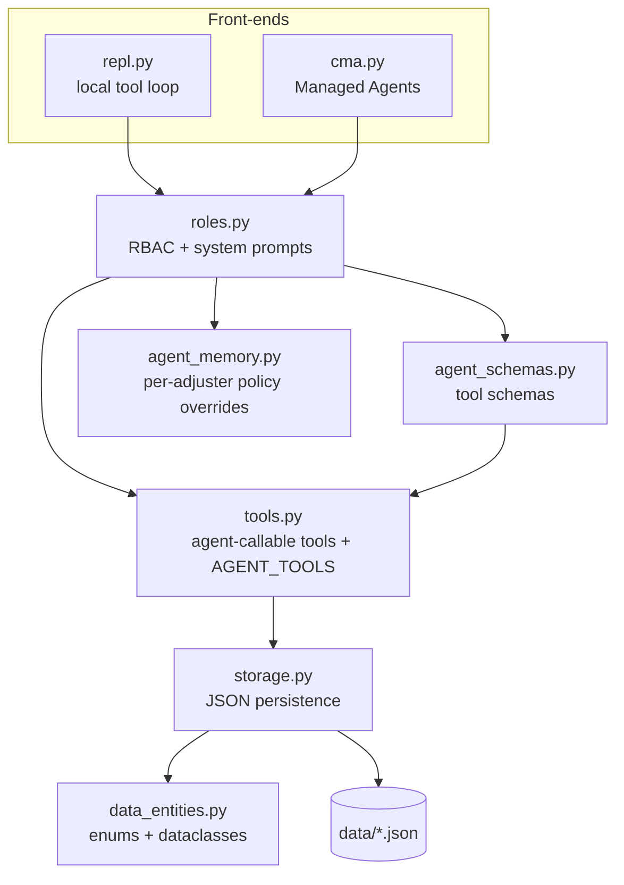
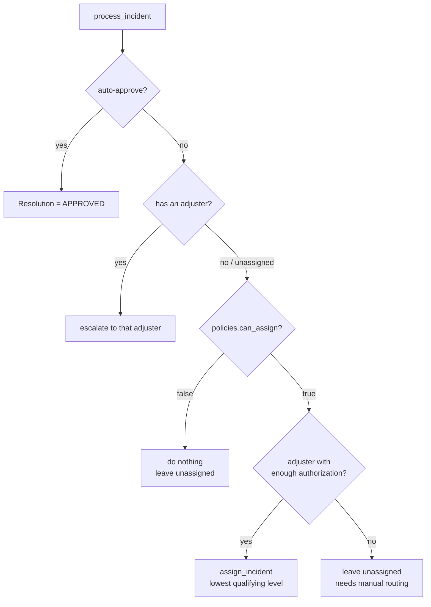

# Insurance Claims Agent (Managed Agents mock)

A small, self-contained sandbox for building and testing **Claude agents** against a
mock insurance-claims domain. It models adjusters, policyholders, policies, and
incident reports (claims), exposes the domain as a set of **role-restricted agent
tools**, and provides two interchangeable front-ends:

- **`repl.py`** — a local agent chat + deterministic test bed. Runs the LLM either
  through the **Claude Agent SDK** (default; the `claude` CLI's subscription auth, no
  API key) or the **Anthropic API** (`--use-key`). Also has deterministic commands that
  need no LLM at all. Great for fast iteration.
- **`cma.py`** — the hosted **Managed Agents (CMA)** version. Anthropic runs the agent
  loop in a per-session container; adjuster memory lives in real Managed Agents memory
  stores.

Both share the same domain logic, role-based access control, and tool schemas, so the
local and hosted paths stay in lockstep.

> **Terminology note:** `Insurer` here models the **insured party** (the
> policyholder/customer), *not* the insurance company.

---

## Contents

- [Architecture](#architecture)
- [Domain model](#domain-model)
- [Roles & access control](#roles--access-control)
- [Auto-approval & routing logic](#auto-approval--routing-logic)
- [Setup](#setup)
- [Using the local REPL (`repl.py`)](#using-the-local-repl-replpy)
- [Using Managed Agents (`cma.py`)](#using-managed-agents-cmapy)
- [Observability (`agent_obs`)](#observability-agent_obs)
- [Project layout](#project-layout)
- [Development notes](#development-notes)

---

## Architecture

The code is deliberately layered so each concern is isolated and testable:



- **`data_entities.py`** — enums (`ReportType`, `PolicyType`, `Resolution`,
  `ReportStatus`, `AuthorizationLevel`), dataclasses (`Adjuster`, `Insurer`, `Policy`,
  `Incident`, `Escalation`, `DynamicPolicies`), and their JSON (de)serialization. No I/O.
- **`storage.py`** — file paths under `data/` and the load/save/update layer.
- **`tools.py`** — the **only** agent-callable functions, plus the `AGENT_TOOLS`
  registry (the single source of truth for what an agent may see).
- **`agent_schemas.py`** — introspects `AGENT_TOOLS` (signatures + type hints +
  Google-style docstrings) to emit Anthropic Messages API tool schemas. Run it to
  regenerate `agent_tools_schema.json`.
- **`roles.py`** — role-based access control shared by both front-ends: per-role tool
  allow-lists and the per-persona system prompts.
- **`agent_memory.py`** — `data/agent_memory.json`, a per-adjuster store of
  `DynamicPolicies` overrides + notes; `effective_policies()` merges them onto the
  defaults.

---

## Domain model

| Entity | Key | Notes |
|---|---|---|
| `Adjuster` | `user_id` (e.g. `jaime`) | Staff who handle claims. Has an `authorization_level` (`LOW`/`MEDIUM`/`HIGH`). |
| `Insurer` | `id` (e.g. `ins-1001`) | The **policyholder**. `is_VIP` affects auto-approval. |
| `Policy` | `id` (e.g. `pol-2001`) | Coverage held by an insurer (`auto`/`home`/`other`). |
| `Incident` | `id` (e.g. `case-3001`) | A claim. Links a policy, an adjuster, and an insurer. |
| `Escalation` | `incident_id` | Queued request for an adjuster to approve/deny. |

Relationships:

```
Incident --policy_id--> Policy --insurer_id--> Insurer (policyholder)
Incident --adjuster_id--> Adjuster
Incident --insurer_id--> Insurer   (secondary/redundant direct link)
```

Key enums: `ReportType` is an `IntFlag` bitmask — `STOLEN_CAR` (1),
`STOLEN_OTHER` (2), `CAR_ACCIDENT` (4), `HOME_THEFT` (8), `HOME_ACCIDENT` (16),
`HOME_NATURAL_DISASTER` (32) — combinable with `|`, plus a `HOME` composite alias
covering the three dwelling flags. `Resolution` (`APPROVED`/`DENIED`/`INPROGRESS`/
`DISPUTED`/`MANAGEMENT_OVERRIDE`) and `ReportStatus` (`NEW`/`OPEN`/`NOTIFIED`/
`CLOSED`) track a claim's lifecycle.

`AuthorizationLevel` is `LOW`/`MEDIUM`/`HIGH` plus `OVERRIDE_NEEDED` — not an
authority anyone holds, but the marker for a claim beyond every band.
`required_authorization(cost)` returns it instead of `None` above
`authorization_high`, and `Adjuster` rejects it as a value for
`authorization_level`. Compare levels with `.rank`; test holdability with
`.is_assignable`.

`Resolution.is_terminal` is the single definition of "this claim's review is
over": `APPROVED`, `DENIED` and `MANAGEMENT_OVERRIDE` are terminal — they stamp
`resolved_date`, clear any pending escalation, and make the claim eligible for the
auto-close pass. `INPROGRESS` and `DISPUTED` are not, and neither is the
`ESCALATED_TO_MANAGEMENT` *status* — a claim with management is still live.

**Escalation to management.** An adjuster can hand a claim up for any reason with
`escalate_to_management(incident_id, reason)`; the agent does it automatically
when a claim's cost exceeds every authorization band. Either way the status
becomes `ESCALATED_TO_MANAGEMENT`, any pending adjuster escalation is withdrawn,
and the resolution stays `INPROGRESS` until management calls `update_resolution`
with `MANAGEMENT_OVERRIDE`. `process_incident` returns such a claim untouched, so
a scheduled triage pass is idempotent and never decides over management's head.

```
cost <= authorization_high   -> route to an adjuster at that level
cost >  authorization_high   -> OVERRIDE_NEEDED -> ESCALATED_TO_MANAGEMENT
                                -> MANAGEMENT_OVERRIDE (terminal) -> auto-close
```

A claim counts as a **home** claim for auto-approval ceilings when its policy is
`PolicyType.HOME` *or* its `incident_type` carries any `ReportType.HOME` flag, so
a dwelling loss filed against a non-HOME policy still gets the home ceilings.

---

## Roles & access control

Every persona is limited to a specific slice of the tool surface (`ROLE_TOOLS` in
`roles.py`). The same allow-list filters the schemas sent to Claude **and** the local
dispatch table, so a persona can never call a tool it isn't granted.

- **ADJUSTER** — manage their claims and escalations: list/inspect, approve/deny,
  escalate, update status, notify, and log history/notes. Their auto-approval policy
  comes from `agent_memory` (defaults + overrides).
- **INSURER** — a policyholder. Can only (1) file a new claim conversationally and
  (2) ask about the status of *their own* claims. New claims are routed to the intake
  adjuster `unassigned`.
- **AGENT** — the unattended maintenance persona. Routes unassigned incidents to
  authorization-appropriate adjusters, triages them via `process_incident`, and closes
  stale resolved claims. On the Agent SDK backend it then **delegates the decisions
  to adjuster subagents** (below) rather than making them itself. It alone holds
  `generate_unassigned_incidents(count)`, which **replaces** the whole claim set
  with 5–50 fresh randomly generated unassigned claims — a demo/load-test reset,
  and the reason an adjuster must not have it.

### Adjuster subagents (Agent SDK backend only)

An AGENT session registers one subagent per adjuster on the roster —
`adjuster-jaime`, `adjuster-sam`, `adjuster-jane` — via
`ClaudeAgentOptions.agents`. The maintenance agent triages and routes, hands each
adjuster's claims to their own subagent with the Agent tool, and folds the reports
back into its summary. Definitions are generated in `repl._adjuster_agents()` from
`adjusters.json`, so a new adjuster gets a subagent with no code change.

Identity is structural rather than advisory: it is fixed in the definition name and
baked into the prompt by `roles.build_system_prompt(Role.ADJUSTER, user_id)` — the
same prompt the interactive `/adjuster` persona uses, plus an override lifting the
"confirm first" rule (a subagent has nobody to confirm with) and pinning it to its
own adjuster id. The caller cannot get the identity wrong by forgetting to state it.

**One tradeoff to know.** Subagents resolve tools against the single MCP server the
session registers, so an AGENT session now serves the **AGENT ∪ ADJUSTER union**
(25 tools, `roles.session_roles`) instead of AGENT alone. Each subagent is narrowed
back to the 21 ADJUSTER tools by its `AgentDefinition.tools`. Part of the
enforcement therefore moves from *"the function is not in the dispatch table"* to
*"the tool is not on this agent's allow-list"* — `_dispatch` still refuses anything
outside the table, but the table is now wider than the parent role alone.

The `--use-key` backend runs the tool loop itself and cannot launch subagents, so it
stays single-agent and its prompt gets no delegation section; `cma.py` has its own
coordinator mechanism and is unaffected.

---

## Auto-approval & routing logic

The heart of the domain is `tools.process_incident`, driven by a `DynamicPolicies`
object (defaults, overridable per call or via adjuster memory).

**1. Auto-approve?** `DynamicPolicies.should_auto_approve` approves a claim whose cost
is below the highest applicable ceiling:

| Ceiling | Default | Applies when |
|---|---|---|
| `auto_approve` | `300` | always (baseline) |
| `vip_auto_approve` | `500` | policyholder is VIP |
| `upset_auto_approve_home` | `1500` | policyholder upset **and** HOME policy |
| `vip_auto_approve_home` | `5000` | VIP **and** HOME policy |

`agent_override_autoapprove` short-circuits to approve regardless of cost.

**2. Not approved → route or escalate**, based on `can_assign` and whether the incident
already has an adjuster:



**Routing by authorization level.** `DynamicPolicies.required_authorization(cost)` maps a
claim's cost to the minimum adjuster `AuthorizationLevel` (limits are configurable):

| Cost | Required level |
|---|---|
| `≤ authorization_low` (500) | `LOW` |
| `≤ authorization_medium` (1500) | `MEDIUM` |
| `≤ authorization_high` (5000) | `HIGH` |
| `> authorization_high` | none — needs manual routing |

Routing picks the **lowest-authorization adjuster that qualifies** (ties broken by id).
Because routing only *assigns*, the agent (or the offline test bed) calls
`process_incident` a second time on a just-assigned incident so it reaches an
approve/escalate decision.

---

## Setup

**Requirements:** Python 3.11+ (uses `StrEnum`, `X | None` unions).

```bash
# 1. Create a virtualenv and install dependencies
python3 -m venv .venv
source .venv/bin/activate
pip install -r requirements.txt
#   For the CMA YAML generator (gen_cma_yaml.py), install the dev extras instead:
#   pip install -r requirements-dev.txt

# 2a. Default mode — no API key. Install and log into the Claude Code CLI:
#     https://code.claude.com  (then `claude` and sign in with your subscription)
#     repl.py's default backend drives this CLI via claude-agent-sdk.

# 2b. --use-key mode — provide an Anthropic API key instead:
cp .env.example .env
#     then edit .env and set ANTHROPIC_API_KEY=sk-ant-...
```

`.env` and `.key` are git-ignored — never commit credentials.

> The deterministic maintenance commands (`/agent`, `/agent-run`) need neither a key
> nor the CLI — they run pure Python with no LLM.

---

## Using the local REPL (`repl.py`)

```bash
python3 repl.py            # LLM via the Claude Agent SDK (claude CLI subscription auth)
python3 repl.py --use-key  # LLM via the Anthropic API (ANTHROPIC_API_KEY from .env)
```

The LLM personas work in **both** modes — `--use-key` only selects the backend:

| Mode | Backend | Auth | Needs |
|---|---|---|---|
| default | **Claude Agent SDK** (drives the `claude` CLI, which runs the agent loop) | CLI subscription — `.env` is not read and `ANTHROPIC_API_KEY` is unset for the process | `claude-agent-sdk` + a logged-in `claude` CLI |
| `--use-key` | Anthropic API directly (local tool loop) | `ANTHROPIC_API_KEY` loaded from `.env` | `anthropic` + `python-dotenv` |

Either way the role's allowed tools and system prompt come from `roles.py`, and the
deterministic commands (`/agent`, `/agent-run`) work with no LLM at all.

**`cma.py` always loads `.env`.** Managed Agents is API-only — there is no
subscription path like the CLI's — so it reads `ANTHROPIC_API_KEY` on every run
rather than behind a flag, and prints which credential it resolved at startup.
An exported `ANTHROPIC_API_KEY` still beats `.env` (`load_dotenv` does not
override), and with no key anywhere it falls through to an `ant auth login`
profile. A value that isn't a `sk-ant-…` key is rejected up front with a clear
message: an API key **outranks** a profile in the SDK's resolution order, so a
leftover placeholder does not quietly fall back to a working profile — it goes
out on the wire and returns a 401.

Assume a persona, then chat. In default mode the SDK exposes our role-restricted tools
as in-process MCP tools (`mcp__insurance__<fn>`) and gates them with
`permission_mode="dontAsk"` so the model can call exactly those and nothing else.

| Command | LLM? | Description |
|---|---|---|
| `/adjuster <name>` | yes | Assume an adjuster (e.g. `/adjuster jaime`). |
| `/insurer <id>` | yes | Assume a policyholder (e.g. `/insurer ins-1001`). |
| `/agent-chat` | yes | Assume the AGENT persona and drive route/triage via the LLM. |
| `/agent-run [--dry-run]` | no | Deterministic route + triage + close. `--dry-run` (or `-n`) previews with **no writes**. |
| `/agent` | no | Run only the close-stale maintenance pass. |
| `/policies [name]` | — | View or select mock policies (`default` / `no-assign` / `generous`). |
| `/whoami` | — | Show current role and selected policy. |
| `/reset` | — | Clear the conversation (keep the role). |
| `/help`, `/quit` | — | Help / exit. |

### Test bed: policies & dry runs

`MOCK_AGENT_POLICIES` in `repl.py` stands in for the `DynamicPolicies` an agent would
load from memory. Three presets ship (`default`, `no-assign`, `generous`); edit or add
your own. The selected preset is injected into the AGENT prompt **and** used by the
offline runner.

`/agent-run --dry-run` executes the **real** `process_incident` code path inside a
snapshot/rollback of `data/`, then restores every file — so it's side-effect-free and
re-runnable. This lets you compare how different policies would route the same
incidents without touching your fixtures:

```
(no role)> /policies generous
(no role)> /agent-run --dry-run
Route & triage (4 open incident(s)) [DRY RUN — no changes written]:
  - case-3002: would auto-approve (no routing needed)
  - case-3003: would route & escalate to sam
  - case-3004: would route & escalate to jane
  - case-3005: would stay unassigned (cost 9000 exceeds every authorization limit) — needs manual routing
```

Drop `--dry-run` to actually persist the decisions.

---

## Using Managed Agents (`cma.py`)

The hosted version runs the agent loop in Anthropic's infrastructure and uses real
Managed Agents **memory stores** for adjuster memory. Requires a workspace with Managed
Agents enabled.

```bash
python3 cma.py
# then, in the REPL:
/setup                 # provision environment + per-role agents + memory stores (idempotent)
/mcp                   # which transport the tools use, and is the server reachable
/update-agents         # push this file's prompts + tools onto the live agents
/adjuster jaime        # start a hosted adjuster session
/insurer  ins-1001     # start a hosted policyholder session
/agent                 # run the maintenance agent
```

### Tool transport: custom tools vs MCP (`mcp_server.py`)

The 32 domain tools reach a hosted agent one of two ways. **Custom tools** is the
default and needs nothing: Anthropic hands each call back to us over the session
event stream and waits while we execute it. **MCP** serves the same tools from an
HTTP server that Anthropic calls directly, so the session never blocks on us —
which is what makes unattended and scheduled runs possible.

```bash
python3 mcp_server.py --new-token      # generate MCP_BEARER_TOKEN
python3 mcp_server.py --print-config   # check what it resolved (token fingerprinted)
python3 mcp_server.py                  # serve on 127.0.0.1:8787
```

Set `MCP_PUBLIC_URL` + `MCP_BEARER_TOKEN` in `.env` and run `/update-agents`.
`MCP_TOOLS=0` forces the inline path back on without clearing them. With both
unset — the default — nothing about `cma.py` changes.

`mcp_server.py` is a **facade**: every call lands on `repl._dispatch` against a
`roles.dispatch_table`, so `tools.py`, `storage.py` and `agent_schemas.py` are
untouched and each call is traced by `@agent_obs.traced_dispatch` exactly as on
the other backends. One endpoint per role — `/mcp/adjuster`, `/mcp/insurer`,
`/mcp/agent` — each serving only that role's tools, which keeps the guarantee
`roles.dispatch_table` makes. A single endpoint with per-agent `mcp_toolset`
filtering would be simpler to host, but that filter changes what the model is
*offered*, not what the server will *execute*.

**It is not a latency win here.** The tools are local JSON file I/O at 2-9 ms and
MCP replaces that with a network round trip. Adopt it for availability.

Auth is a static bearer token — the agent object has no auth field, so the token
lives in a Managed Agents **vault** keyed by endpoint URL and reaches the run via
`vault_ids`. `ensure_vault` reconciles those by URL, because the URL is what moves
when the server is re-homed.

**Deploying it.** For a public endpoint — which is what unattended runs need —
see **[ACA_Deploy.md](ACA_Deploy.md)**: a `Dockerfile` and step-by-step Azure
Container Apps setup, including how to start and stop it to keep the cost at
zero between runs. Container Apps rather than Azure Functions because the
Functions MCP extension would force all 41 tool schemas to be re-declared by
hand in a vocabulary that cannot express our enums, nested objects, or nullable
unions. The image is the deployable subset only — no `cma.py`, no `anthropic`,
no Agent SDK; a test asserts the `COPY` list still covers `mcp_server`'s real
import closure.

#### What the facade cannot simply wrap

Four places need more than delegation, and one is a genuine architectural split:

1. **Concurrency.** `storage.py` is whole-file read-modify-write with no locking —
   safe today only because every backend dispatches serially. An HTTP server does
   not, so `dispatch_guarded` holds a process lock across the *entire* call.
   Locking just the write would not help: two callers that each read before either
   writes still lose one another's changes, across unrelated records.
2. **Schema generation.** `FastMCP` derives input schemas from Python signatures
   via pydantic with no override, which would discard
   `agent_schemas.build_tool_schemas()` — the docstring parsing, the `ReportType`
   bitmask descriptions, and the nullable-optional fix. The low-level
   `mcp.server.lowlevel.Server` is used instead so our schemas publish verbatim.
3. **Adjuster memory is sandbox-side, tools are server-side.** `/mnt/memory` is a
   mount inside Anthropic's container, reachable only by the prebuilt toolset —
   the MCP server cannot see it. That split is fine today (the adjuster reads its
   memory in the sandbox and passes the resulting `policies` object to our tool),
   but the two stores are not the same thing and cannot be merged by the facade.
4. **Where `data/` lives.** Hosting the server elsewhere means the hosted tools and
   your local `repl.py` read different state. Nothing in the facade reconciles
   that; centralising storage is a separate decision. Related: `agent_memory.py`
   binds its path from `storage.DATA_DIR` **at import**, so it escapes any later
   redirection of that constant.

One smaller caveat: the server runs its own `Observability` run (`front_end="mcp"`,
its own trace files) because `agent_obs.current()` is a process global. Tool events
are traced normally, but spans may root themselves rather than nest under the
session span — events carry `run_id`, so correlation is unaffected.

`/setup` writes resource IDs to `data/cma_config.json`, which the runtime consumes.
Per-role models are configured in `MODEL_BY_ROLE` (`INSURER`→Haiku, `ADJUSTER`→Sonnet,
`AGENT`→Opus). Adjuster sessions mount the adjuster's memory store at
`/mnt/memory/<store>/`.

### Version-controlled provisioning (`ant` CLI)

`gen_cma_yaml.py` generates, under `cma/`, an equivalent **declarative** setup from the
same `cma`/`roles`/`agent_schemas` code (so it can't drift): the environment YAML, one
agent YAML per role, adjuster memory seed files, and `setup.sh`. Running `cma/setup.sh`
provisions the same resources via the `ant` CLI and writes the same
`data/cma_config.json`. The SDK path (`cma.setup()`) and the CLI path (`cma/setup.sh`)
are interchangeable.

---

## Observability (`agent_obs`)

`agent_obs/` is a self-contained tracing package wired into **both** front-ends. It
records four independent layers, each append-only JSONL, each switchable on its own:

| Layer | File | Answers |
|---|---|---|
| `events` | `var/traces/<run>.events.jsonl` | what happened, in order |
| `spans` | `var/traces/<run>.otel.jsonl` | OpenTelemetry `session → turn → tool`, with durations |
| `wire` | `var/traces/<run>.wire.jsonl` | the real HTTP payloads: system prompt, messages, tool schemas, `cache_control` |
| `usage` | `var/ledger.jsonl` | per-turn tokens, cache hits, cost — comparable across backends |

Files are keyed on a **run id** we mint (`repl-20260724-151727-38fd57`);
`var/runs.jsonl` maps runs to provider session ids. All output is gitignored.

```bash
python3 repl.py                     # events + spans + usage + tool tracing (default)
python3 repl.py --wire              # + capture the real API payloads
python3 repl.py --obs-redact dev    # keep (truncated) content instead of hashing it
python3 repl.py --wire --obs-wire-tools skeleton \
       --obs-wire-tools-keep 'mcp__insurance__*'   # drop the CLI's ambient tool schemas
python3 repl.py --no-obs            # trace nothing
python3 cma.py --wire               # same layers for the Managed Agents front-end
```

In either REPL: `/obs` for status and file paths, `/obs tail [n]` for the event log,
`/obs stats [backend|role|model|kind]` for ledger totals.

**Coverage.** All three LLM paths are instrumented: the Agent SDK backend (hooks +
message-stream observation + wire), the `--use-key` Anthropic API backend (one
ledger row per `messages.create`, `extra.loop_turn` numbering the tool loop), and
Managed Agents (session-event tracing, usage from `session` events). Tool calls are
traced for all three at once, because they all execute through `repl._dispatch`,
which carries the `@agent_obs.traced_dispatch` decorator.

**Redaction** (`--obs-redact`, `OBS_REDACT`). Credentials are dropped in every mode,
including `none`.

| Mode | Behaviour |
|---|---|
| `flow` *(default)* | Each string written **in full the first time it appears**; every later appearance becomes `{"_t": "seen", "preview": <first 20 chars>, "chars": N, "sha": …}`. Since every request resends the whole conversation, each request shows what is *new* with the history collapsed to a followable skeleton — and the `sha` locates the full text earlier in the same file. |
| `strict` | No content at all: every string becomes `{chars, sha}`. Structure, tool names, message counts, and `cache_control` placement survive. Use when a trace might leave this machine. |
| `dev` | Every string kept, truncated to `max_field_chars`. No repeat collapsing, so long conversations get large. |
| `none` | Passthrough. Synthetic data only. |

Tune with `OBS_PREVIEW_CHARS` (default 20), `OBS_MAX_FIELD_CHARS` (default 4000 —
sized so a typical tool description or system prompt fits whole on first sight), and
`OBS_MIN_COLLAPSE_CHARS` (default 200 — strings below this are never collapsed, so
tool/function/model/session names stay verbatim however often they repeat).
Diagnostic strings (`error`, `proxy_error`, `line`) are truncated rather than hashed
in every mode, so traces stay debuggable.

`flow` also collapses repeated **subtrees**, not just repeated strings: a dict or
list above `OBS_MIN_NODE_CHARS` (default 500) that has been written before becomes
`{"_t": "seen_node", "kind", "chars", "sha"}`. This is what handles a resent JSON
Schema — every string inside one is a field name below the string floor, so no
per-string rule can collapse it. Disable with `--no-collapse-structures` /
`OBS_COLLAPSE_STRUCTURES=0`.

**Tool-definition shaping** (`--obs-wire-tools`, `OBS_WIRE_TOOLS`) — wire layer only,
and lossy, so it is opt-in and a shaped row is stamped `"_shaped"`.

On the Agent SDK path the `claude` CLI builds the tool list and ships every native
tool plus every MCP server configured on the machine, not just the ones this app
registers. Measured on a real run here: **118 definitions, 268 KB per request, of
which 8 tools (4.4 KB) were ours** — and third-party servers interpolate account
state into their descriptions (that capture contained real Slack user ids and
workspace URLs). So this is a privacy control as much as a size one.

| Mode | Each tool becomes |
|---|---|
| `full` *(default)* | verbatim — the capture stays faithful |
| `skeleton` | `{name, params, required, desc_chars, sha}` (~55 B) |
| `names` | `{name, sha}` |

`--obs-wire-tools-keep` takes comma-separated `fnmatch` patterns kept verbatim —
normally one pattern for the server this app registers, so a tool added later keeps
its schema without anyone updating a list:

```bash
python3 repl.py --wire --obs-wire-tools skeleton --obs-wire-tools-keep 'mcp__insurance__*'
```

The per-tool `sha` covers the original definition, so a shaped trace can still prove
the tool list was byte-identical between turns. Measured over the 6-request capture
above: 1,059 KB verbatim → 570 KB with `flow` alone → **263 KB** once subtrees
collapse → **59 KB** with `skeleton` + `keep`.

Reading a `flow`-mode wire log, four requests into a session:

```
--- request 3:  291865 B | tools=130 | messages=4
    tools[0]   : 'Agent' desc=seen: 'Launch a new agent t' (1574 ch, sha 6db6259110b2)
    msg[0] user      : seen: '<system-reminder>\nAs' (851 ch, sha cc2d6a10af4c)
    msg[1] system    : seen: 'Available agent type' (6720 ch, sha 9a589d8308bf)
    msg[2] assistant : FULL TEXT (26 ch)          <- new this request
    msg[3] user      : list[1]                    <- new this request
```

**Nothing here changes agent behaviour.** All 10 SDK hooks are registered and every
callback returns `{}`; authorization stays in `roles.py`. A failed capture proxy
sets `wire_error` and the run continues.

Design rationale, the defects this fixes relative to the code it was distilled
from, and the decision log: [`docs/observability-design.md`](docs/observability-design.md).
Env-var configuration (`OBS_*`) is documented on `ObsConfig.from_env`.

---

## Project layout

```
.
├── agent_obs/              # observability package (events, spans, wire, usage)
│   ├── facade.py           #   Observability — the object a front-end constructs
│   ├── config.py           #   ObsConfig + OBS_* env vars
│   ├── events.py           #   semantic event log
│   ├── spans.py            #   OTel session → turn → tool (opentelemetry optional)
│   ├── wire.py             #   local capture proxy (requests + responses)
│   ├── usage.py            #   TurnRecord/ledger + one adapter per backend
│   ├── redact.py           #   strict/dev/none, applied at the sink boundary
│   ├── sinks.py            #   JsonlSink: lock, size cap, rotation
│   ├── tooltrace.py        #   @traced_dispatch — backend-independent tool tracing
│   ├── sdk.py              #   10 tracing-only hooks + message-stream observation
│   └── logbridge.py        #   stdlib logging -> event log
├── data_entities.py        # enums, dataclasses, (de)serialization
├── storage.py              # data/ paths + load/save/update layer
├── tools.py                # agent-callable tools + AGENT_TOOLS registry
├── agent_schemas.py        # generate tool schemas -> agent_tools_schema.json
├── agent_tools_schema.json # generated Anthropic tool schemas
├── roles.py                # RBAC + per-persona system prompts
├── agent_memory.py         # per-adjuster DynamicPolicies overrides + notes
├── repl.py                 # local REPL / test bed (front-end)
├── cma.py                  # Managed Agents front-end
├── gen_cma_yaml.py         # generate declarative CMA setup under cma/
├── manual_setup.py         # standalone Managed Agents quickstart/scratch example
├── cma/                    # generated environment/agent YAML + setup.sh + seeds
├── data/                   # JSON persistence (see below)
├── docs/
│   └── observability-design.md   # tracing design, defect analysis, decision log
├── tests/                  # pytest;  .venv/bin/python -m pytest tests/ -q
│   ├── conftest.py         # `world` fixture — storage redirected at a scratch data/
│   ├── test_agent_obs.py   # agent_obs unit tests
│   └── test_triage.py      # triage path: ceilings, routing, escalation, auto-close
├── var/                    # trace output + usage ledger (gitignored, created on run)
├── CHANGELOG.md            # detailed change history
└── README.md
```

### `data/` (JSON persistence & sample data)

| File | Contents |
|---|---|
| `adjusters.json` | Adjusters (`jaime`=LOW, `sam`=MEDIUM, `jane`=HIGH, `unassigned`). |
| `insurers.json` | 5 sample policyholders (mix of VIP). |
| `policies.json` | 5 sample policies cross-referencing insurers. |
| `incidents.json` | Sample claims cross-referencing policies/insurers/adjusters. |
| `agent_memory.json` | Per-adjuster policy overrides + notes (seeded for `jaime`). |
| `escalations.json` | Escalation queue (created on demand). |
| `cma_config.json` | Managed Agents resource IDs (created by `/setup`). |

> `/agent-run` (without `--dry-run`), `/agent`, and the LLM personas mutate these files —
> they are real runs, not previews. Use `--dry-run` to preview safely.

---

## Development notes

- **Regenerate tool schemas** after changing tool signatures/docstrings:
  ```bash
  python3 agent_schemas.py    # rewrites agent_tools_schema.json (29 tools)
  ```
- **Single source of truth:** only functions in `tools.AGENT_TOOLS` are exposed to
  agents. The `data_entities` model and `storage` persistence layer are internal.
- **Keep hosted & local in sync:** both front-ends go through `roles.py`,
  `agent_schemas.py`, and the shared dispatcher, so schemas and allowed actions match.
- **Changelog:** all notable changes are recorded in
  [`CHANGELOG.md`](./CHANGELOG.md) (Keep a Changelog format, date-stamped).
```
