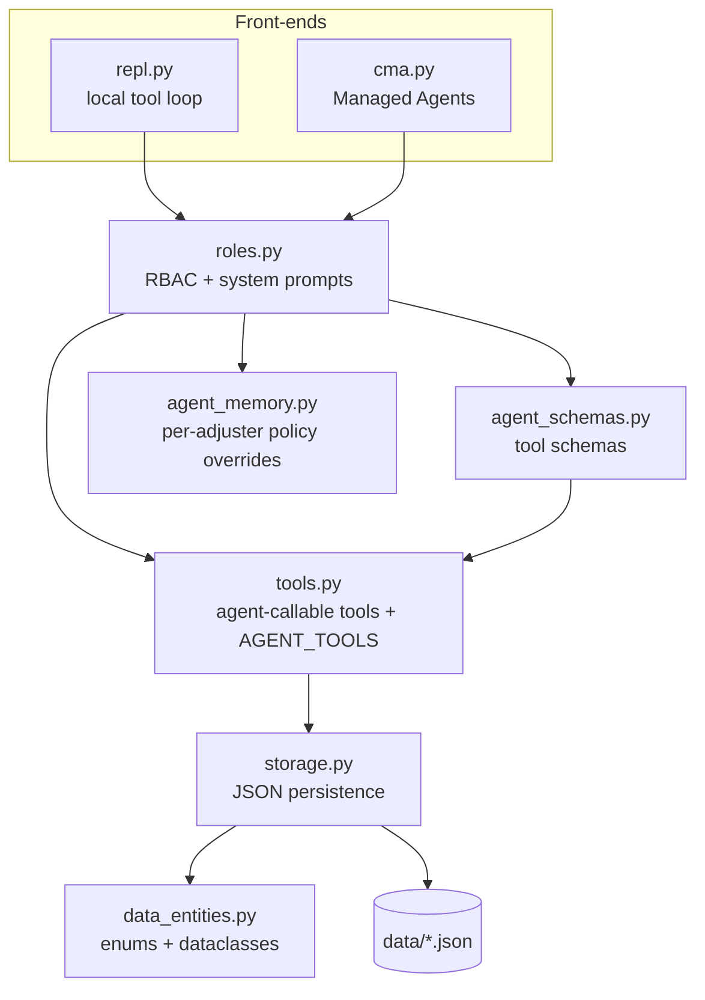
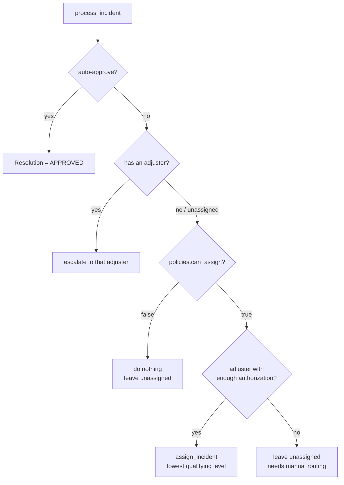

# Insurance Claims Agent (Managed Agents mock)

A small, self-contained sandbox for building and testing **Claude agents** against a
mock insurance-claims domain. It models adjusters, policyholders, policies, and
incident reports (claims), exposes the domain as a set of **role-restricted agent
tools**, and provides two interchangeable front-ends:

- **`repl.py`** — a local agent chat + deterministic test bed. The tool loop runs on
  your machine; great for fast iteration and for exercising logic with (or without) an
  API key.
- **`cma.py`** — the hosted **Managed Agents (CMA)** version. Anthropic runs the agent
  loop in a per-session container; adjuster memory lives in real Managed Agents memory
  stores.

Both share the same domain logic, role-based access control, and tool schemas, so the
local and hosted paths stay in lockstep.

> **Terminology note:** `Insurer` here models the **insured party** (the
> policyholder/customer), *not* the insurance company.

---

## Contents

- [Architecture](#architecture)
- [Domain model](#domain-model)
- [Roles & access control](#roles--access-control)
- [Auto-approval & routing logic](#auto-approval--routing-logic)
- [Setup](#setup)
- [Using the local REPL (`repl.py`)](#using-the-local-repl-replpy)
- [Using Managed Agents (`cma.py`)](#using-managed-agents-cmapy)
- [Project layout](#project-layout)
- [Development notes](#development-notes)

---

## Architecture

The code is deliberately layered so each concern is isolated and testable:



- **`data_entities.py`** — enums (`ReportType`, `PolicyType`, `Resolution`,
  `ReportStatus`, `AuthorizationLevel`), dataclasses (`Adjuster`, `Insurer`, `Policy`,
  `Incident`, `Escalation`, `DynamicPolicies`), and their JSON (de)serialization. No I/O.
- **`storage.py`** — file paths under `data/` and the load/save/update layer.
- **`tools.py`** — the **only** agent-callable functions, plus the `AGENT_TOOLS`
  registry (the single source of truth for what an agent may see).
- **`agent_schemas.py`** — introspects `AGENT_TOOLS` (signatures + type hints +
  Google-style docstrings) to emit Anthropic Messages API tool schemas. Run it to
  regenerate `agent_tools_schema.json`.
- **`roles.py`** — role-based access control shared by both front-ends: per-role tool
  allow-lists and the per-persona system prompts.
- **`agent_memory.py`** — `data/agent_memory.json`, a per-adjuster store of
  `DynamicPolicies` overrides + notes; `effective_policies()` merges them onto the
  defaults.

---

## Domain model

| Entity | Key | Notes |
|---|---|---|
| `Adjuster` | `user_id` (e.g. `jaime`) | Staff who handle claims. Has an `authorization_level` (`LOW`/`MEDIUM`/`HIGH`). |
| `Insurer` | `id` (e.g. `ins-1001`) | The **policyholder**. `is_VIP` affects auto-approval. |
| `Policy` | `id` (e.g. `pol-2001`) | Coverage held by an insurer (`auto`/`home`/`other`). |
| `Incident` | `id` (e.g. `case-3001`) | A claim. Links a policy, an adjuster, and an insurer. |
| `Escalation` | `incident_id` | Queued request for an adjuster to approve/deny. |

Relationships:

```
Incident --policy_id--> Policy --insurer_id--> Insurer (policyholder)
Incident --adjuster_id--> Adjuster
Incident --insurer_id--> Insurer   (secondary/redundant direct link)
```

Key enums: `ReportType` is an `IntFlag` bitmask (`STOLEN_CAR`/`STOLEN_OTHER`/
`CAR_ACCIDENT`, combinable with `|`); `Resolution` (`APPROVED`/`DENIED`/`INPROGRESS`/
`DISPUTED`) and `ReportStatus` (`NEW`/`OPEN`/`NOTIFIED`/`CLOSED`) track a claim's
lifecycle.

---

## Roles & access control

Every persona is limited to a specific slice of the tool surface (`ROLE_TOOLS` in
`roles.py`). The same allow-list filters the schemas sent to Claude **and** the local
dispatch table, so a persona can never call a tool it isn't granted.

- **ADJUSTER** — manage their claims and escalations: list/inspect, approve/deny,
  escalate, update status, notify, and log history/notes. Their auto-approval policy
  comes from `agent_memory` (defaults + overrides).
- **INSURER** — a policyholder. Can only (1) file a new claim conversationally and
  (2) ask about the status of *their own* claims. New claims are routed to the intake
  adjuster `unassigned`.
- **AGENT** — the unattended maintenance persona. Routes unassigned incidents to
  authorization-appropriate adjusters, triages them via `process_incident`, and closes
  stale resolved claims.

---

## Auto-approval & routing logic

The heart of the domain is `tools.process_incident`, driven by a `DynamicPolicies`
object (defaults, overridable per call or via adjuster memory).

**1. Auto-approve?** `DynamicPolicies.should_auto_approve` approves a claim whose cost
is below the highest applicable ceiling:

| Ceiling | Default | Applies when |
|---|---|---|
| `auto_approve` | `300` | always (baseline) |
| `vip_auto_approve` | `500` | policyholder is VIP |
| `upset_auto_approve_home` | `1500` | policyholder upset **and** HOME policy |
| `vip_auto_approve_home` | `5000` | VIP **and** HOME policy |

`agent_override_autoapprove` short-circuits to approve regardless of cost.

**2. Not approved → route or escalate**, based on `can_assign` and whether the incident
already has an adjuster:



**Routing by authorization level.** `DynamicPolicies.required_authorization(cost)` maps a
claim's cost to the minimum adjuster `AuthorizationLevel` (limits are configurable):

| Cost | Required level |
|---|---|
| `≤ authorization_low` (500) | `LOW` |
| `≤ authorization_medium` (1500) | `MEDIUM` |
| `≤ authorization_high` (5000) | `HIGH` |
| `> authorization_high` | none — needs manual routing |

Routing picks the **lowest-authorization adjuster that qualifies** (ties broken by id).
Because routing only *assigns*, the agent (or the offline test bed) calls
`process_incident` a second time on a just-assigned incident so it reaches an
approve/escalate decision.

---

## Setup

**Requirements:** Python 3.11+ (uses `StrEnum`, `X | None` unions).

```bash
# 1. Create a virtualenv and install dependencies
python3 -m venv .venv
source .venv/bin/activate
pip install -r requirements.txt
#   For the CMA YAML generator (gen_cma_yaml.py), install the dev extras instead:
#   pip install -r requirements-dev.txt

# 2. Provide Anthropic credentials
cp .env.example .env
#   then edit .env and set ANTHROPIC_API_KEY=sk-ant-...
#   (or export ANTHROPIC_API_KEY in your shell, or use `ant auth login`)
```

`.env` and `.key` are git-ignored — never commit credentials.

> Only the LLM-driven paths need a key. The deterministic maintenance commands
> (`/agent`, `/agent-run`) run without one.

---

## Using the local REPL (`repl.py`)

```bash
python3 repl.py
```

Assume a persona, then chat. The agent acts through the role-restricted tools; the tool
loop runs locally.

| Command | LLM? | Description |
|---|---|---|
| `/adjuster <name>` | yes | Assume an adjuster (e.g. `/adjuster jaime`). |
| `/insurer <id>` | yes | Assume a policyholder (e.g. `/insurer ins-1001`). |
| `/agent-chat` | yes | Assume the AGENT persona and drive route/triage via the LLM. |
| `/agent-run [--dry-run]` | no | Deterministic route + triage + close. `--dry-run` (or `-n`) previews with **no writes**. |
| `/agent` | no | Run only the close-stale maintenance pass. |
| `/policies [name]` | — | View or select mock policies (`default` / `no-assign` / `generous`). |
| `/whoami` | — | Show current role and selected policy. |
| `/reset` | — | Clear the conversation (keep the role). |
| `/help`, `/quit` | — | Help / exit. |

### Test bed: policies & dry runs

`MOCK_AGENT_POLICIES` in `repl.py` stands in for the `DynamicPolicies` an agent would
load from memory. Three presets ship (`default`, `no-assign`, `generous`); edit or add
your own. The selected preset is injected into the AGENT prompt **and** used by the
offline runner.

`/agent-run --dry-run` executes the **real** `process_incident` code path inside a
snapshot/rollback of `data/`, then restores every file — so it's side-effect-free and
re-runnable. This lets you compare how different policies would route the same
incidents without touching your fixtures:

```
(no role)> /policies generous
(no role)> /agent-run --dry-run
Route & triage (4 open incident(s)) [DRY RUN — no changes written]:
  - case-3002: would auto-approve (no routing needed)
  - case-3003: would route & escalate to sam
  - case-3004: would route & escalate to jane
  - case-3005: would stay unassigned (cost 9000 exceeds every authorization limit) — needs manual routing
```

Drop `--dry-run` to actually persist the decisions.

---

## Using Managed Agents (`cma.py`)

The hosted version runs the agent loop in Anthropic's infrastructure and uses real
Managed Agents **memory stores** for adjuster memory. Requires a workspace with Managed
Agents enabled.

```bash
python3 cma.py
# then, in the REPL:
/setup                 # provision environment + per-role agents + memory stores (idempotent)
/adjuster jaime        # start a hosted adjuster session
/insurer  ins-1001     # start a hosted policyholder session
/agent                 # run the maintenance agent
```

`/setup` writes resource IDs to `data/cma_config.json`, which the runtime consumes.
Per-role models are configured in `MODEL_BY_ROLE` (`INSURER`→Haiku, `ADJUSTER`→Sonnet,
`AGENT`→Opus). Adjuster sessions mount the adjuster's memory store at
`/mnt/memory/<store>/`.

### Version-controlled provisioning (`ant` CLI)

`gen_cma_yaml.py` generates, under `cma/`, an equivalent **declarative** setup from the
same `cma`/`roles`/`agent_schemas` code (so it can't drift): the environment YAML, one
agent YAML per role, adjuster memory seed files, and `setup.sh`. Running `cma/setup.sh`
provisions the same resources via the `ant` CLI and writes the same
`data/cma_config.json`. The SDK path (`cma.setup()`) and the CLI path (`cma/setup.sh`)
are interchangeable.

---

## Project layout

```
.
├── data_entities.py        # enums, dataclasses, (de)serialization
├── storage.py              # data/ paths + load/save/update layer
├── tools.py                # agent-callable tools + AGENT_TOOLS registry
├── agent_schemas.py        # generate tool schemas -> agent_tools_schema.json
├── agent_tools_schema.json # generated Anthropic tool schemas
├── roles.py                # RBAC + per-persona system prompts
├── agent_memory.py         # per-adjuster DynamicPolicies overrides + notes
├── repl.py                 # local REPL / test bed (front-end)
├── cma.py                  # Managed Agents front-end
├── gen_cma_yaml.py         # generate declarative CMA setup under cma/
├── manual_setup.py         # standalone Managed Agents quickstart/scratch example
├── cma/                    # generated environment/agent YAML + setup.sh + seeds
├── data/                   # JSON persistence (see below)
├── CHANGELOG.md            # detailed change history
└── README.md
```

### `data/` (JSON persistence & sample data)

| File | Contents |
|---|---|
| `adjusters.json` | Adjusters (`jaime`=LOW, `sam`=MEDIUM, `jane`=HIGH, `unassigned`). |
| `insurers.json` | 5 sample policyholders (mix of VIP). |
| `policies.json` | 5 sample policies cross-referencing insurers. |
| `incidents.json` | Sample claims cross-referencing policies/insurers/adjusters. |
| `agent_memory.json` | Per-adjuster policy overrides + notes (seeded for `jaime`). |
| `escalations.json` | Escalation queue (created on demand). |
| `cma_config.json` | Managed Agents resource IDs (created by `/setup`). |

> `/agent-run` (without `--dry-run`), `/agent`, and the LLM personas mutate these files —
> they are real runs, not previews. Use `--dry-run` to preview safely.

---

## Development notes

- **Regenerate tool schemas** after changing tool signatures/docstrings:
  ```bash
  python3 agent_schemas.py    # rewrites agent_tools_schema.json (29 tools)
  ```
- **Single source of truth:** only functions in `tools.AGENT_TOOLS` are exposed to
  agents. The `data_entities` model and `storage` persistence layer are internal.
- **Keep hosted & local in sync:** both front-ends go through `roles.py`,
  `agent_schemas.py`, and the shared dispatcher, so schemas and allowed actions match.
- **Changelog:** all notable changes are recorded in
  [`CHANGELOG.md`](./CHANGELOG.md) (Keep a Changelog format, date-stamped).
```
